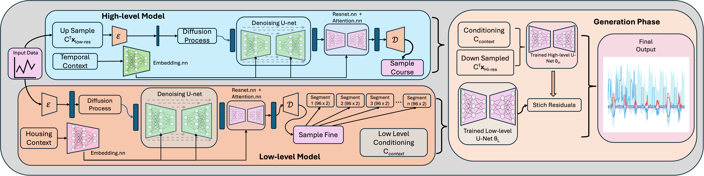

# HiDiffEnergy



# HiDiffEnergy: A Hierarchical Diffusion Model for Energy Load Generation

HiDiffEnergy is a deep learning project for generating high-fidelity, long-sequence synthetic residential energy load profiles.  
It utilizes a two-stage hierarchical diffusion model to capture both the long-term structure and the short-term volatile details of electricity consumption and solar generation data from the **Ausgrid dataset**.

---

## Abstract
Generating realistic long-term energy consumption and solar
generation data is challenging because the data contain multi-
scale temporal features, ranging from long-term seasonal
trends to short-term daily and hourly households behaviors.
Existing generative approaches tend to overlook this multi-
scale nature, capturing either large-scale trends or small-scale
variations, but rarely both. We propose HiDiff-Energy, a hier-
archical diffusion framework with two stages. The high-level
model captures global dynamics over weeks and months,
while the low-level adds high-frequency, household-level
variations. To handle long sequences efficiently, the low-level
trains on shorter segments but produces outputs that remain
coherent across the full time span. The model also includes
conditional embeddings of household identity and tempo-
ral context, which help preserve each household’s unique
consumption patterns. With this hierarchical design, HiDiff-
Energy can generate realistic, individualized energy data over
extended periods, accurately modeling both large-scale trends
and fine-scale features 

---

## Features
- **Hierarchical Generation**: Coarse-to-fine approach generates long, coherent time-series data.  
- **Conditional Modeling**: Conditioned on household, temporal, and seasonal factors for context-aware and diverse profiles.  

---
## Data
We obtain our data from [**Ausgrid**][[https://www.ausgrid.com.au/Industry/Our-Research/Data-to-share] [**Pecan Street**][https://www.pecanstreet.org/dataport/ ]. You can check out data processing files for cleaning up the extra columns fixing sensor issues.

## Setup

Clone the repository:
```bash
git clone https://github.com/your-username/HiDiffEnergy.git
```
Create a Python virtual environment:
```
python -m venv venv
source venv/bin/activate  # On Windows: venv\Scripts\activate
```
Install dependencies:
```
pip install -r requirements.txt
```
Then run the train.py for each of the code.
```
python train.py

```

## Additional Resources for reference

Below are links and articles that might help with **hyperparameter tuning**, **theoretical insights**, and **practical guidelines**

---

### 1.TimeGan
For an in-depth explanation or theoretical background:
- **Official Documentation**: (https://github.com/openai/maddpg](https://github.com/jsyoon0823/TimeGAN))

---

### 2. TimeVAE
For an in-depth explanation or theoretical background:
- **Official Documentation**:(https://github.com/jsyoon0823/TimeGAN](https://github.com/wangyz1999/timeVAE-pytorch))


### 3. Diffusion model
For **implementation details** and **hyperparameter**
- **Official Documentation**: (https://github.com/amazon-science/unconditional-time-series-diffusion)

  
### 4. Conditional UNet1DModel
For **implementation details** and **hyperparameter**
- **Hugging Face**: ([https://github.com/amazon-science/unconditional-time-series-diffusion](https://huggingface.co/docs/diffusers/api/models/unet))

  
### 5. ResNet-Pytorch
For **implementation details** and **hyperparameter**
- **Github**: (https://github.com/JayPatwardhan/ResNet-PyTorch?tab=readme-ov-file)
- **Pytorch- github** : (https://github.com/pytorch/vision/blob/main/torchvision/models/resnet.py)
- **Paper**- (https://arxiv.org/pdf/1512.03385)
- **Original Repo From Paper**- (https://github.com/KaimingHe/deep-residual-networks)


